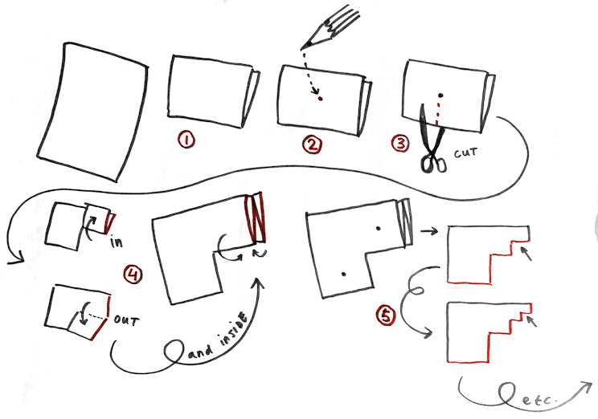
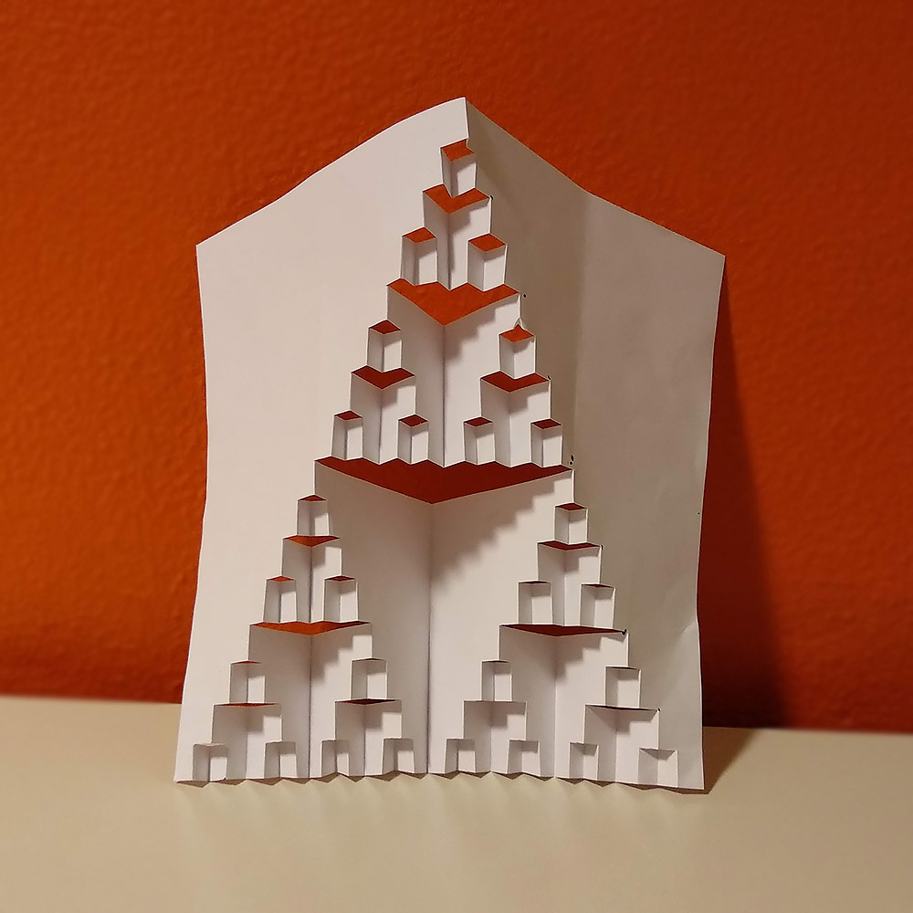
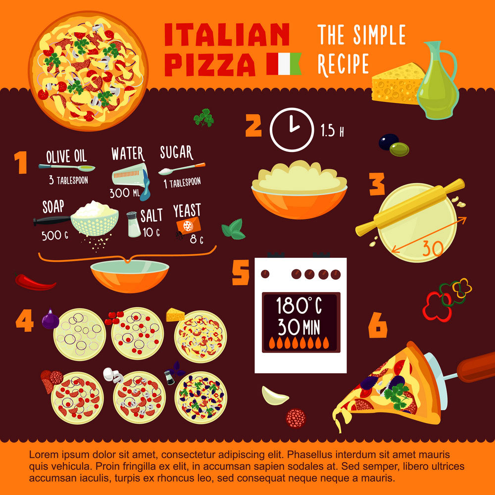
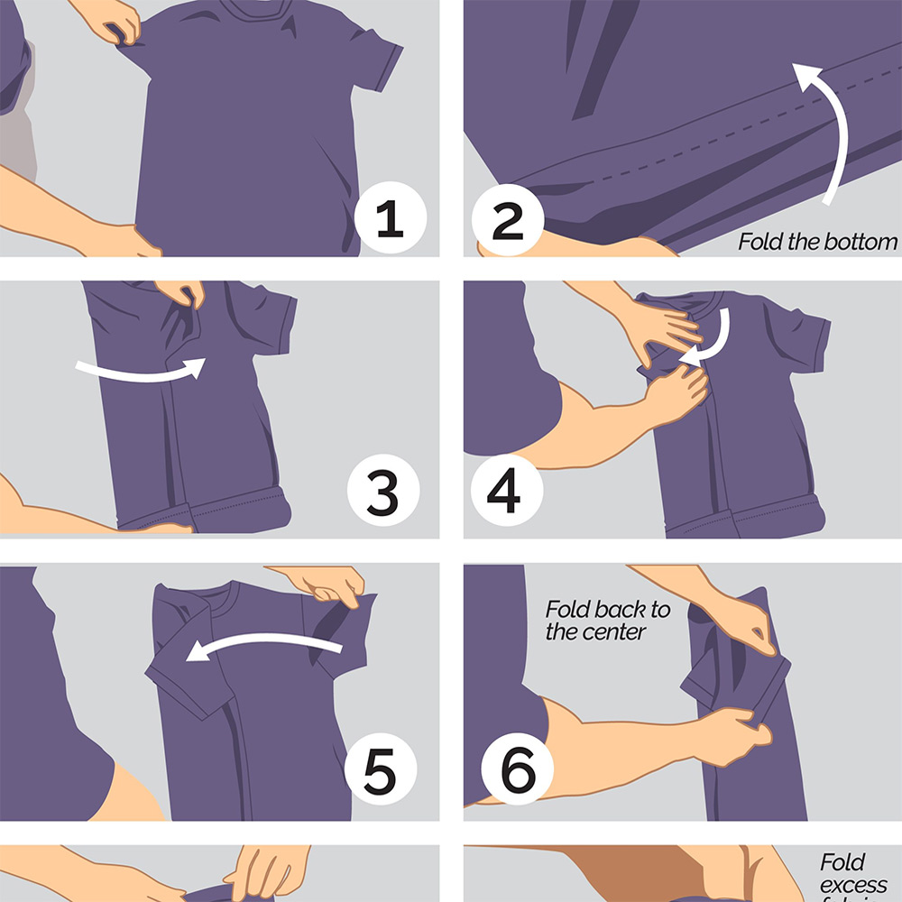
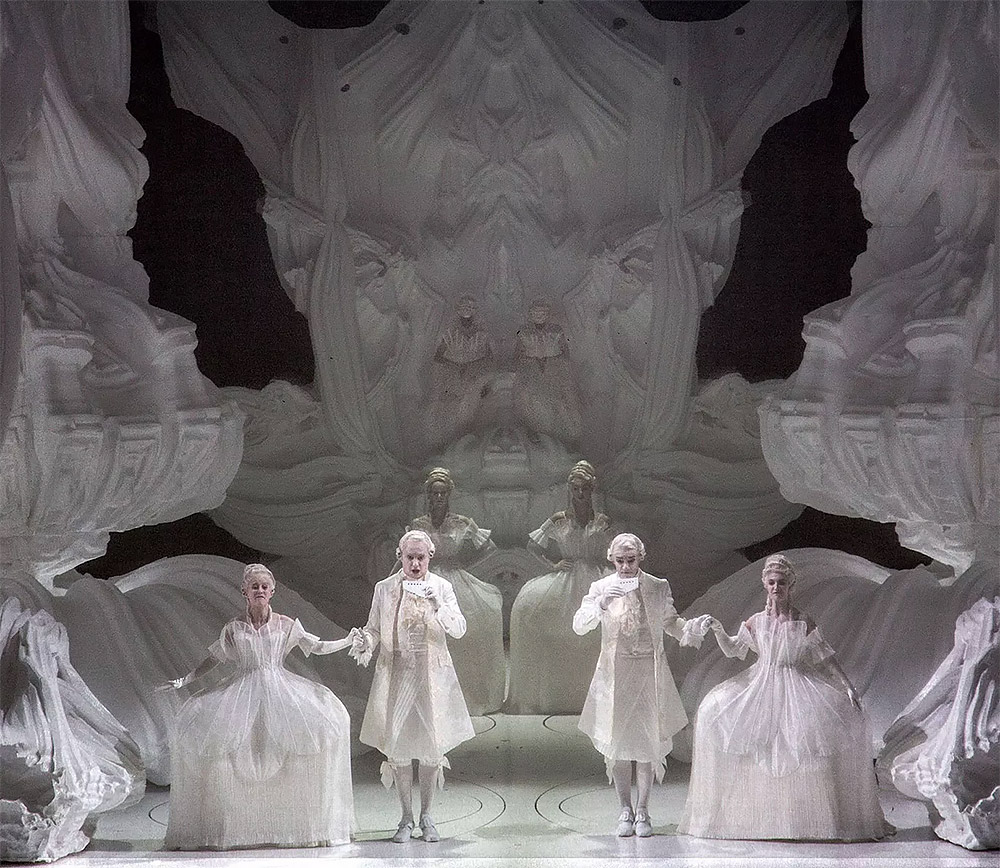
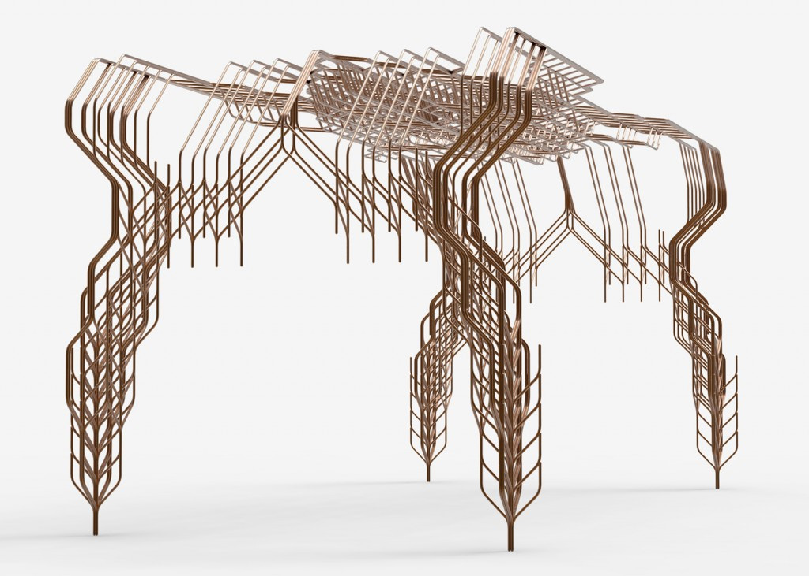
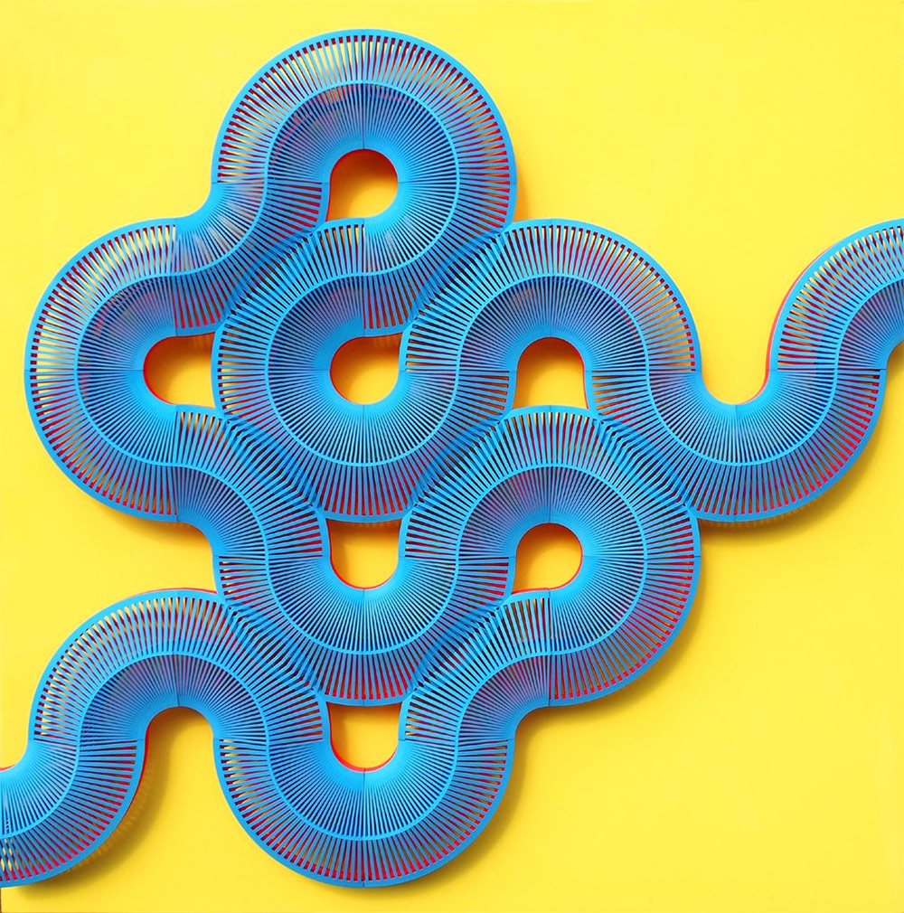
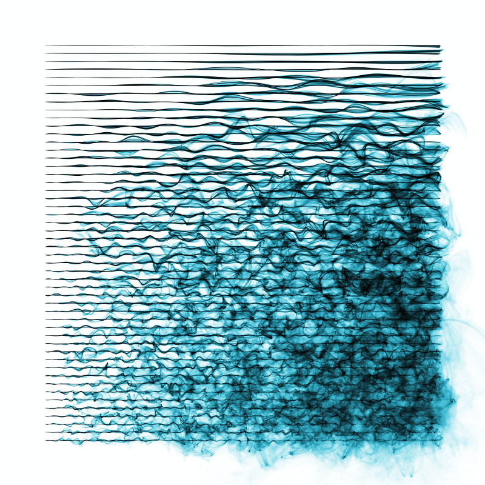
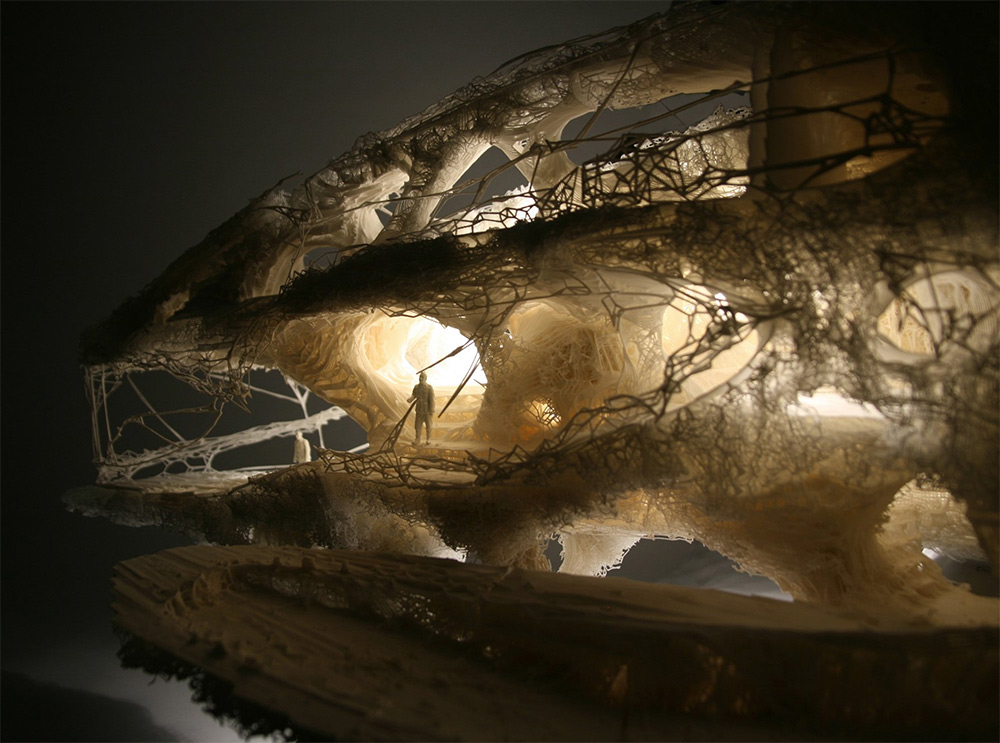

# Become an  <big><big><big>Algorist!</big></big></big>
  
 
 

<big><big><f-next-button title="START" /></big></big>

   

<button v-for="(s, i) in range(0, 23, 1)" v-on:click="send('goto', i)">{{ i }}</button>

<!-- <f-buttons set="slideIndex" :buttons="range(0, 23, 1)" v-on:click="send('goto', get('slideIndex') )" /> -->

---

| 1 1
| 2 3 

# Warming up... 

-
 
Let's start with a small warming-up exercise.

1. Fold a sheet of A4 paper <mark>in half</mark> <small>*(short edge to short edge)*</small> 
2. Find the <mark>center</mark> and mark it with a pen  <small>*(don't have to be TOO precise)*</small> 
3. From the <mark>closed edge</mark> cut the paper to the center point 
4. Fold the right ‘flap’ <mark>up</mark>, then back <mark>down</mark> again <small>*(to get a folding line)*</small>. Then fold the 'flap' <mark>inside</mark> itself.
5. <mark>Repeat</mark> steps 2 to 5 for each rectangle for a few times over and over again <small>*(until the rectangles become too small to cut or fold)*</small>

**Do not open the paper until you are done!**

 

<f-prev-button /> <f-next-button title="Next: see the result" />

-

---

| 1 2 
 
# Nice work! 
 
Now if you fold the paper open, you probably end up with something like shown on this picture. 
 
By following the steps of cutting and folding you were performing a so called <big>**ALGORITHM**</big>.

  

<f-prev-button /> <f-next-button title="Next: definition" />

-

---

# <big>an Algorithm</big>

### in mathematics and computer science, is an unambiguous specification of how to solve a class of problems [(Wikipedia)](https://en.wikipedia.org/wiki/Algorithm).

 

Or to put it simple:

### <mark>an algorithm is a set of certain steps needed to solve a problem</mark> 
  
  

<f-prev-button /> <f-next-button title="Next: they are everywhere!" />

  

---

| 1 1 2 2 
 
# Actually, we solve problems with algorithms every day

Probably without even noticing. These are often called <mark>everyday algorithms</mark>**. Let's take a look at some examples. 
 
Maybe the most common example of an everyday algorithm is ***cooking***.

  

<f-prev-button /> <f-next-button title="Next: more everyday algorithms" />

-

 
 
~
<small><small>*You have to follow certain steps (recipe) to make a delicious meal.*</small></small>
~

---

| 1 1
| 2 3
| 4 4

# More examples of everyday algorithms

-

#### Folding a t-shirt
 
 
 
~
<small><small>*There are more than one methods to fold a t-shirt. Every method is a "different algorithm" of t-shirt folding.*</small></small>
~

-

#### Building a brick wall
 
 
 
~
<small><small>*Building a stable brick wall is based on an algorithm too: you have to put the bricks so that every other row of bricks is shifted by half compared to previous one.*</small></small>
~

-

<f-hr />
 

<f-prev-button /> <f-next-button title="Next: computer algorithms" />

---

| 1 1 2
| 1 1 2

# Computer generated algorithms

Cooking, folding a t-shirt, building a wall. These activities consist of relatively simple instructions (i.e. ‘algorithms’).

### Computers also perform algorithms. More complex algorithms may require a lot of computing power - so much that normally people cannot manage it by themselves.
 
Computers and design go together well. This last decade has seen the emergence of a new way of designing that’s all about the conscious use of algorithms mixed with the computational power of computers. A lot of designers, artists and architects have been using computers and complex algorithms to create stunning work.

  

<f-prev-button /> <f-next-button title="Next" />

---

# It is important to remember:

- Not all computational design is generative design
- And not all generative design is computational.
- Not every use of computer in design is ‘generative’

### Let's take a look at some examples of design computer generated algorithms

  

<f-prev-button /> <f-next-button title="Next: algorithms in design" />

---

| height: fit 

| 1 1 2
| 1 1 3

<!--  -->
<f-image src="./images/candy-hansmeyer.jpg" style="background-position:50% 90%;" />

<small>*Zauberflöte 2018 (available at http://www.michael-hansmeyer.com/zauberfloete, accessed on 24.01.2019)*</small>

-

## Grotto set design by Michael Hansmeyer
 
Grotto set design for Mozart's opera Zauberflöte, directed by Romoeo Castellucci

~*“I want to assume the mozartian potion and bring it to its maximum effect, and here in the gardens is the artificial grotto, the feathers of the fowler, the ceruse white with the artificial fly, the symmetry, palace of the 18th century.”*~

*http://www.michael-hansmeyer.com/*

  

<f-prev-button /> <f-next-button title="Next" />

---

| height: fit

| 1 1 2
| 1 1 3

<!--  -->
<f-image src="./images/candy-dezeen.jpg" style="background-position:30% 50%;" />

<small> *Tucker 2016, (available at https://www.dezeen.com/2016/03/26/stefan-bassing-barlett-school-architecture-digital-modelling-table-no-1-2-identical-components/, accessed on 24.01.2019)* </small>

-

## A table by Stefan Bassing

Designer Stefan Bassing has used digital modelling to create a pair of tables, made from repetitive elements to simplify the production process.

~*“Once the furniture is created as a digital model, the role of the computer is at forefront. The computer numerically controls (CNC) the bending machine, converting steel rods into parts for use. Then, these would be assembled by a craftsperson, before being copper plated.”*~

*https://stefanbassing.com/*

  

<f-prev-button /> <f-next-button title="Next" />

---

| height: fit
| 1 1 2
| 1 1 3

<!--  -->

<f-image src="./images/candy-maclachlan.jpg" style="background-position:50% 50%" />

<small> *Entangle 2017 (available at https://lynnemaclachlan.co.uk/blogs/projects/entangle-wall-tiles, accessed on 24.01.2019)* </small>

-

## “Entangle” Wall Tiles by Lynne MacLachlan

“Entangle” is a 3D printed wall tilling system, taking inspiration from mathematical tiling principles and quantum mechanics.

~*“Based on the mathematical principles of Truchet tiles, two modular segments can be combined in a myriad of different ways. It is possible to create various wave patterns, knot designs, complex repeating patterns or fill space in an apparently random fashion. (McLachlan 2017).”*~
 
https://lynnemaclachlan.co.uk/

  

<f-prev-button /> <f-next-button title="Next" />

---

| height: fit
| 1 1 2
| 1 1 3

<!--  -->

<f-image src="./images/candy-sandspline.jpg" style="background-position:50% 50%" />

<small> *Sand spline (available at  https://inconvergent.net/generative/sand-spline/, accessed on 24.01.2019)* </small>

-

## “Sand Spline” - generative art by Anders Hoff

The idea is based on the concept of mathematical B-splines.

The author mentions that in mathematics a B-spline is a smooth spline that is drawn from a number of nodes (control points) without necessarily passing through the nodes themselves.

https://inconvergent.net/

  

<f-prev-button /> <f-next-button title="Next" />

---

| height: fit
| 1 1 2
| 1 1 3

<!--  -->

<f-image src="./images/candy-softkill.jpg" style="background-position:50% 50%" />

        
  <small> *Fairs 2012 (available at https://www.dezeen.com/2012/10/23/protohouse-by-softkill-design/, accessed on 24.01.2019)* </small>

-

## “ProtoHouse” by SoftKill

Softkill Design has recently completed “ProtoHouse”, a prototype for the first 3D printed house, that has the same structure as human bones.

The ProtoHouse project was developed in the Architectural Association School's Design Research Lab within the 'behavioral matter' studio of Robert Stuart-Smith. The project investigated the architectural potential of the latest Selective Laser Sintering technologies, testing the boundaries of large scale 3D printing. The designing was done with computer algorithms that micro-organize the printed material itself.

http://protohouse.tumblr.com/

  

<f-prev-button /> <f-next-button title="Next" />

---

# Ok...

You might think that probably they use very expensive supercomputers plus knowledge of wizardry to make such stuff. However, with basic knowledge of coding we can demonstrate that ***even quite simple sets of rules can create quite interesting results***. 
 
## But...

  

<f-prev-button /> <f-next-button title="But... what?" />

---

| 1 1 1 1 1
| 2 3 4 5 6
| 7 7 7 7 7 

## Firstly, we have to understand the very basics of how computer algorithms work. It possesses five key aspects:

<f-hr style="margin:5vh 0;" />

-

# **1**
### FINITENESS
The algorithm **must always terminate** after a finite number of steps.

-

# **2**
### DEFINITENESS
**Each step must be precisely defined;** the actions to be carried out must be rigorously and unambiguously specified for each case.

-

# **3** 
### INPUT 
An algorithm **has zero or more inputs**, taken from a specified set of objects.

-

# **4** 
### OUTPUT
An algorithm **has one or more outputs**, which have a specified relation to the inputs.

-

# **5** 
### EFFECTIVENESS
**All operations** to be performed must be **sufficiently basic** that they can be done exactly and in finite length (Knut 1997)

-

<f-hr style="margin:5vh 0;" />

 

<f-prev-button /> <f-next-button title="Next" />

---

| 1 1 1
| 2 3 4
| 5 5 5

## More specifically, an algorithm is composed of:

<f-hr style="margin:5vh 0;" />

-

<f-card
  color="var(--darkergray)"
  background="var(--lightergray)"
  style="text-align: center;"
>
  
  # **1**
  ### INPUT 
  you feed some parameters (variables) or data to your algorithm

</f-card>

-

<f-card
  color="var(--darkergray)"
  background="var(--lightergray)"
  style="text-align: center;"
>

# **2**
### PROCESSING 
algorithm does the computing

</f-card>

-

<f-card
  color="var(--darkergray)"
  background="var(--lightergray)"
  style="text-align: center;"
>

# **3**
### OUTPUT
you get a result

</f-card>

-

<f-hr style="margin:5vh 0;" />

<f-prev-button /> <f-next-button />

---

## Let's take a look of some simple examples

With this examples you can see how simple shapes combined and some basic operations like repeating, scaling and rotating generate a lot of complex patterns.    
When we add important properties like colour, stroke width, transparency and so on we can alter the algorithm and have a different, much more complex output.

<f-prev-button /> <f-next-button title="Go!" />

---

| 1 2 2
| 3 4 4 
 
## **1** Just some lines

-

***Move the sliders*** and see what happens. Nothing too special here &ndash; our algorithm creates a grid of small lines that change when parameters change. Parameters change when you move the sliders. You should see some kind of a dashed lines pattern. That's it.

-

<!-- <f-slider title="Grid size" 
    from="0.2"
    to="2"
    step="0.01"
    :value="0.6"
    v-on:value="i => set('step1', i)"
/>
<f-slider title="Line length" 
    from="-1"
    to="1"
    step="0.01"
    :value="0.01"
    v-on:value="i => set('width1', i)"
/> -->

<f-slider title="Grid size" 
    from="0.2"
    to="2"
    step="0.01"
    :value="0.6"
    set="step1"
/>
<f-slider title="Line length" 
    from="-1"
    to="1"
    step="0.01"
    :value="0"
    set="width1"
/>

 

<small>***HINT:*** *Try to make the grid size smaller than 0.5 and line longer than 0.3*</small>

  

<f-prev-button /> <f-next-button title="Next: add rotation" v-if="get('step1') < 0.5 && get('width1') > 0.3" />

-

<f-scene  width="600" height="500">
  <f-grid-pattern :step="get('step1',0.6)">
    <f-line 
      :points="[ 
        { x: 0, y: 0 }, 
        { x: get('width1', 0), y: 0 }, 
      ]"  
      :stroke-width="3"  
    /> 
  </f-grid-pattern>
</f-scene>

---

| 1 2 2
| 3 4 4

## **2** Let's add rotation

-

<small>Ok, now you have three sliders - we have added ***rotation***. Play with them and see if you can create any interesting output. </small>

-

<f-slider title="Grid size" 
    from="0.2"
    to="2"
    step="0.01"
    :value="0.3"
    set="step2"
/>
<f-slider title="Line length" 
    from="-3"
    to="3"
    step="0.01"
    :value="0"
    set="width2"
/>
<f-slider title="Rotation" 
    from="-180"
    to="180"
    step="0.1"
    :value="0"
    set="rotation2"
/>

 

<small>***HINT:*** *Try to make the grid size smaller than 0.3, line longer than 2 and rotation bigger than 45*</small>

  

<f-prev-button /> <f-next-button title="Next: boxes" v-if="get('step2') < 0.3 && Math.abs(get('width2')) > 2 && Math.abs(get('rotation2')) > 45" />

-

<f-scene  width="600" height="500">
  <f-grid-pattern :step="get('step2',0.3)">
    <f-group :rotation=" get('rotation2',0) "> 
      <f-line
        :points="[ 
          { x: 0, y: 0 }, 
          { x: get('width2', 0), y: 0 }, 
        ]"  
        :stroke-width="3"  
      /> 
    </f-group>
  </f-grid-pattern>
</f-scene>

---

| 1 2 2
| 3 4 4

## **3**  Boxes

-

Simple lines can get boring quite fast. Let's explore a few more complex shapes. Now let's play with a box. Boxes can get pretty cool if you make them ***overlap*** and ***rotate*** them a bit. Give it a try!

-

<f-slider title="Grid size" 
    from="0.2"
    to="2"
    step="0.01"
    :value="0.9"
    v-on:value="i => set('step3', i)"
/>
<f-slider title="Box size" 
    from="-3"
    to="3"
    step="0.01"
    :value="0.6"
    v-on:value="i => set('width3', i)"
/>
<f-slider title="Rotation" 
    from="-180"
    to="180"
    step="0.1"
    :value="0"
    v-on:value="i => set('rotation3', i)"
/>

 

<small>***HINT:*** *Try to make the grid size smaller than 0.4, box bigger than 1 and rotation higher than 45*</small>

  

<f-prev-button /> <f-next-button title="Next: circles" v-if="get('step3') < 0.4 && Math.abs(get('width3')) > 1 && Math.abs(get('rotation3')) > 45" />

-

<f-scene  width="600" height="500">
  <f-grid-pattern :step="get('step3',0.9)">
    <f-group :rotation="get('rotation3',0)"> 
      <!-- <f-box 
        :stroke-width="3"  
        :width = "get('width3',0.6)" 
        :height = "get('width3',0.6)" 
      />  -->
      <f-box 
        :stroke-width="3"  
        :scale="get('width3',0.6)" 
      /> 
    </f-group>
  </f-grid-pattern>
</f-scene>

---

| 1 2 2
| 3 4 4

## **4** Circles

-

***Circles are just CRAZY!*** Remember - all we are doing here is to repeat one simple circle and adjusting its radius, but the visual output can get very complex and interenting.

-

<f-slider title="Grid size" 
    from="0.2"
    to="2"
    step="0.01"
    :value="0.5"
    v-on:value="i => set('step4', i)"
/>
<f-slider title="Circle size" 
    from="0.1"
    to="2"
    step="0.01"
    :value="0.2"
    v-on:value="i => set('width4', i)"
/>

 

<small>***HINT:*** *Try to make the grid size smaller than 0.3 and circle bigger than 1*</small>

  

<f-prev-button /> <f-next-button title="Next: random" v-if="get('step4') < 0.3 && get('width4') > 1" />

-

<f-scene  width="600" height="500">
  <f-grid-pattern :step="get('step4',0.5)">
    <f-group> 
      <f-circle 
          :stroke-width="3"  
          :r = "get('width4',0.2)" 
        /> 
    </f-group>
  </f-grid-pattern>
</f-scene>

---

| 1 2 2
| 3 4 4
| 5 6 7

## **5** Random

-

Too much control may not always be a good thing &mdash; sometimes you get more interesting and unexpected results if you just let things to happen. Let's allow the computer to generate ***random*** patterns &mdash; all you have to do is to ***press the button***. 

-

<button 
    v-on:click="set( 'randomness', random( 0.5, 1, true) )" class="primary"
    style="background:var(--blue)">Random generator</button>

<small v-if="get('randomness')">***HINT:*** *If the pattern sucks, press the button again - you'll get a new on*</small>

  

<f-prev-button /> <f-next-button v-if="get('randomness')" title="Next" />

-

<f-scene  width="600" height="500">
  <f-grid-pattern :step="random(get('randomness')-0.3, get('randomness')+0.5, true)">
    <f-group> 
      <f-circle 
          :stroke-width="3"  
          :r = "0.02 + random( get('randomness')-0.4, get('randomness')+1, true)" 
        />  
    </f-group>
  </f-grid-pattern>
</f-scene>

---

| 1 1
| 2 3
| 4 4

# That was just a beginning

-

With this examples you can see how simple shapes combined and some basic operations like repeating, scaling and rotating generate a lot of
complex patterns.

When we add important properties like colour, stroke width, transparency and so on we can alter the algorithm and have a different output.

-

  

<f-prev-button /> <f-next-button v-if="get('randomness')" title="Next" />

---

## Are you ready to become an Algorist yourself?
 
Your final task is to create an algorithm for the ‘hardware’ that you started this scenario with: paper and scissors!

-

1. Create a 5-step algorithm
2. Define and enumerate the steps
3. Have fun (:
4. Discuss what is your algorithm and how it can be improved

---

# Thank you!!!